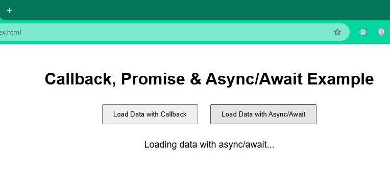
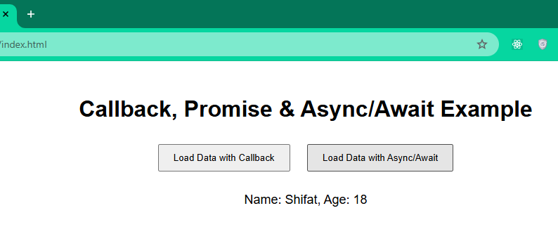

# Callback & Async/Await Demo

This repo demonstrates the basic usage of **JavaScript Callback, Promise, and Async/Await**.  

## What is Callback & Async/Await?
- **Callback:** A function passed into another function to run after some operation is done 🔄  
- **Async/Await:** A modern way to write asynchronous code that looks like synchronous code ⚡

## How it Works
- After clicking a button, the program **waits 1 second** ⏳  
- Then it shows the data on the screen  
- Callback, Promise, and Async/Await handle this delay differently

## Screenshot
 


## Features
- 🔄 Load data using **Callback**
- Load data using **Promise**
- ⚡ Load data using **Async/Await**

## Usage
1. Clone the repo:
   ```bash
   git clone https://github.com/shifat01/Callback-Async-Await.git
2. Open index.html in your browser
